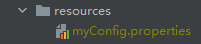
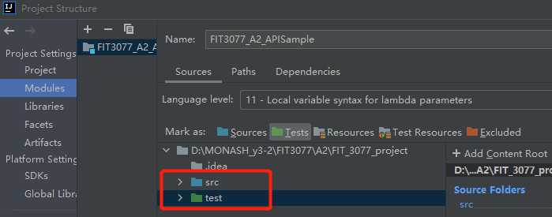
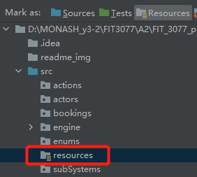

# Notes

1. Design documents are in the *docs* folder;
2. The project is developed by java (JDK1.8) and maven;
3. The External Libraries are (maybe need to check):

### Before running the code:
1. Create "resources" folder in "src" and create a .properties file which is called "myConfig.properties"

2. And add your configuration inside  
rootUrl = https://fit3077.com/api/v1   
API_key = your API key  
(without the quotes for values)

3. Set project structure (if using IntelliJ to run it)  
click *file*->*project structure*->*project structure*

-------------------------------------------------------------

Assumption:
Please refer to the A2_A3_Assumption.doc

Demonstrate Video Link:  
A2 - https://drive.google.com/file/d/1TdoOS_hRERD9WbQu9Zfp9DowtBEoaT09/view?usp=sharing  
A3 -

------------------------------------------
#Menu structure of our system:
### Different user roles would get different services (different interface/pages)  
Following are all services:
1. Go to Login Subsystem  
   1.1 Go to Login  
   1.2 Go to Sign Up  
   1.3 Go back to parent menu  
2. Go to Onsite Testing Subsystem  
    2.1 Go to conduct an interview  
    2.2 Go back to parent menu  
3. Go to Search for testing sites Subsystem  
    3.1 Go to view testing-sites list  
    3.2 Search for testing sites  
    3.3 Go back to parent menu  
4. Go to Onsite Booking Subsystem  
    4.1 Help residents change their booking  
    4.2 Make an on-site booking   
    4.4 Change my booking(venue and timing)  
    4.5 Go back to parent menu  
5. Go to Home-Booking Subsystem  
    5.1 Go to book a Home-Testing  
    5.2 Scan QR Code  
    5.3 Go back to parent menu  
6. View my profile
7. Admin Booking Interface

