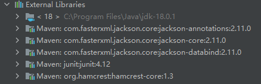

# Notes

1. Design documents are in the *docs* folder;
2. The project is developed by java (JDK1.8) and maven;
3. The External Libraries are (maybe need to check):

### Before running the code:
1. Create "resources" folder in "src" and create a .properties file which is called "myConfig.properties"

2. and add your configuration inside

---
rootUrl = https://fit3077.com/api/v1   
API_key = your API key  
(without the quotes for values)
---

2. set project structure (if using IntelliJ to run it)  
click *file*->*project structure*->*project structure*

-------------------------------------------------------------

Assumption:
1. The “userName” of the user is unique and used to log in.
2. The information about “hasOnSiteBooking”, “hasOnSiteTest”, “waitingTimes(min)”, “facilityType” are in the additionalInfo field of Testing Site.
3. Users can pass the PIN Code to the on-site staff(receptionist) to check their booking, then the system displays the status the booking. The status includes customer info, testing info, created time and testing site info etc.
4. Every user is a customer (isCustomer: true), and whether he/she is a receptionist(isReceptionist) or healthcare worker(isHealthcareWorker) can only be set and updated within the system (Security Issue).
5. When users search for testing site, they only can choose one of suburb name and facility type.
